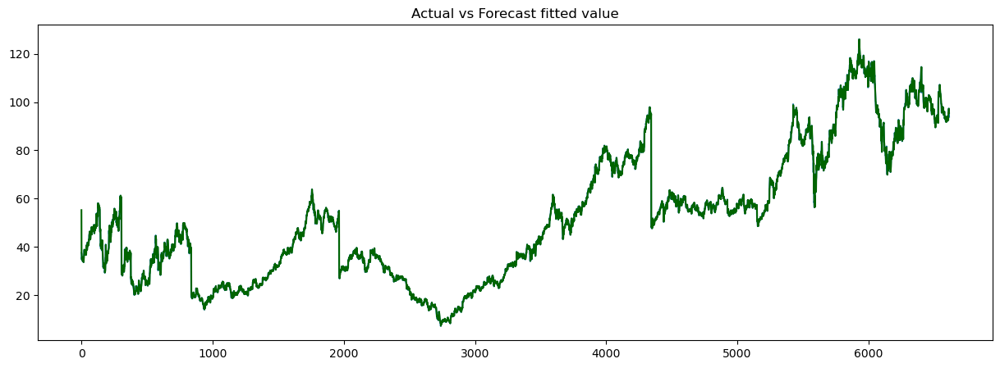
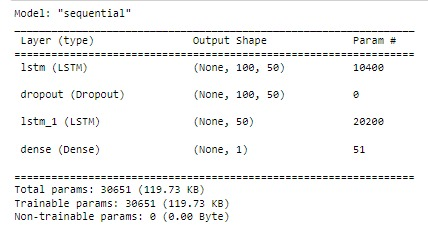
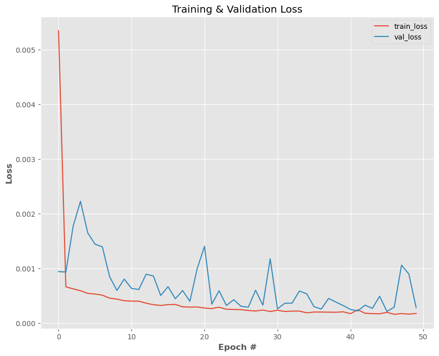
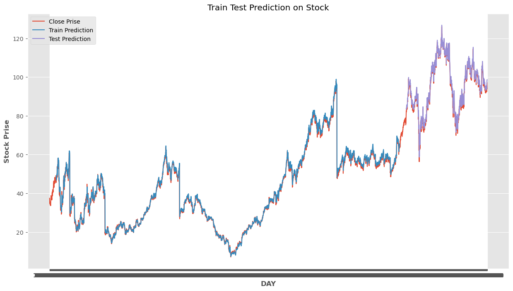
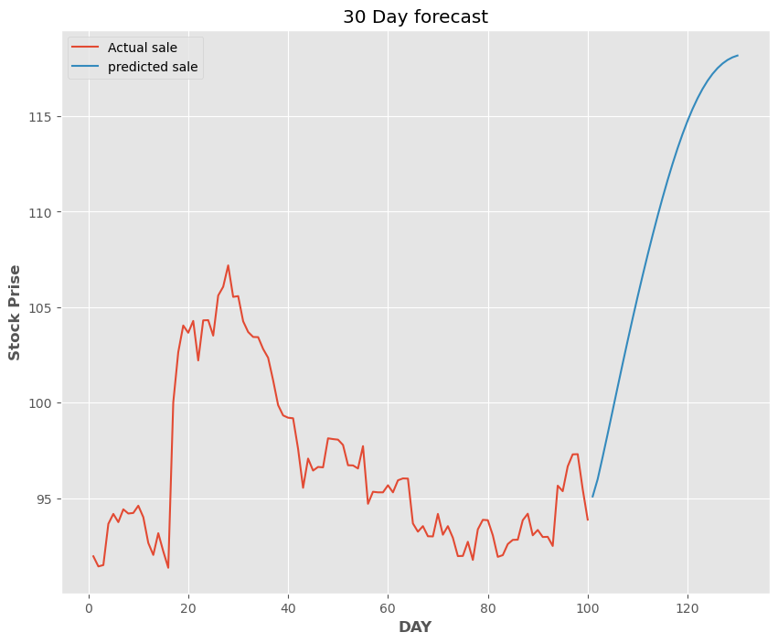

# Time Series Analysis of Starbucks Stocks (1992-06-26 to 2023-12-05)
This repository is dedicated to the time series analysis of Starbucks stock prices from June 26, 1992, to December 5, 2023.Time series analysis is a statistical approach for analyzing time-ordered data to uncover patterns, trends, and seasonal variations. It plays a crucial role in forecasting, decision-making, and strategic planning across various domains.

 

## Importance of Time Series Analysis

* Forecasting: Predict future values based on historical data, essential for finance, economics, and weather prediction.
* Trend Analysis: Identify long-term trends to guide decision-making and strategy.
* Seasonality Detection: Recognize and adjust for seasonal variations, key for inventory and marketing.
* Anomaly Detection: Spot outliers indicating potential issues or extraordinary events.
* Causal Analysis: Understand the impact of time-dependent variables on each other.

   

## Project Focus: Starbucks Stock Analysis

* Growth Trends: Evaluate Starbucks' stock performance over time, identifying periods of growth or decline.
* Seasonal Patterns: Detect any seasonal fluctuations in stock prices.
* Event Impacts: Assess how specific events have historically influenced stock values.
* Future Forecasting: Utilize historical data to predict future stock price movements.
* Volatility Assessment: Analyze the stock's price volatility for better risk management.

## Objective

This project aims to provide comprehensive insights into Starbucks' stock performance using time series analysis, helping investors and analysts make informed decisions based on historical data patterns.

## Getting Started
# 1. Triple Exponential Smoothing Method for Time Series Forecasting :

Forecasting Starbucks stock prices using the Triple Exponential Smoothing method. The model parameters have been optimized, achieving a Mean Absolute Percentage Error (MAPE) of 1.54, indicating a high level of accuracy in predicting stock prices.

## Key Results

* Optimized Parameters:
  * Smoothing Level (α): 0.959
  * Smoothing Trend (β): 2.11e-09
  * Smoothing Seasonal (γ): 5.65e-12
  * Initial Level: 29.41
  * Initial Trend: 0.0066
  * Initial Seasons: nan
  * MAPE Value: 1.54
 
  
* Given these parameters and their implications, the fitted model suggests that the Starbucks stock price series, over the period analyzed, is heavily influenced by the most recent observations with very little weight given to trends or seasonal patterns. This could mean that the stock price is quite volatile, with rapid changes that do not follow a predictable trend or seasonal cycle.

 

* The MAPE value represents the model's average prediction error of 1.54%, signifying robust predictive capabilities.

## Future Predictions

* Forecast Period: 300 Days
 

# 2. Starbucks Stock Price Forecasting with ARIMA

This repository is dedicated to forecasting Starbucks stock prices using the AutoARIMA model from the pmdarima library. The model selection process is automated, optimizing for accuracy in predicting stock prices.

## Model Selection Process

The model selection process involves a stepwise search to minimize the Akaike Information Criterion (AIC). Various ARIMA configurations were evaluated, and the best-fitting model was chosen based on its ability to balance accuracy and simplicity.

## Model Details

After an automated search process, the chosen ARIMA model is ARIMA(1,0,1)(0,0,0)[0] with an intercept term. This model was selected based on the Akaike Information Criterion (AIC), indicating a trade-off between model fit and complexity.

* Fit Time: The model fitting process took approximately 71.299 seconds.
* Mean Absolute Percentage Error (MAPE): The MAPE value for the model is 1.6999%, reflecting the average prediction error.

 
  
## Forecasting for Future 300 Days

Leveraging the selected ARIMA model, the repository provides forecasts for Starbucks stock prices for the next 300 days. Users can explore these forecasts to gain insights into potential future stock price movements.

 

# 3. Serimax Stock Price Forecasting with Seasonal ARIMA (SARIMA)

This repository focuses on forecasting Serimax stock prices using the Seasonal AutoARIMA model from the pmdarima library. The automated model selection process resulted in the best-fitting SARIMA model with the following details:

## Model Selection Process

The SARIMA model selection process involves a stepwise search to minimize the Akaike Information Criterion (AIC). Various SARIMA configurations were evaluated, and the best-fitting model was chosen based on its ability to balance accuracy and simplicity.

## Model Details

After an automated stepwise search process, the chosen SARIMA model is ARIMA(1,0,1)(0,0,0)[12] intercept. This model was selected based on the Akaike Information Criterion (AIC), indicating a trade-off between model fit and complexity.

* Fit Time: The model fitting process took approximately 207.638 seconds.
* Mean Absolute Percentage Error (MAPE): The MAPE value for the model is 1.54%, reflecting the average prediction error.
  

## Forecasting for Future 300 Days

Leveraging the selected SARIMA model, the repository provides forecasts for Serimax stock prices for the next 300 days. Users can explore these forecasts to gain insights into potential future stock price movements.

# 4. Time Series Forecasting with LSTM

This repository contains code for time series forecasting using Long Short-Term Memory (LSTM) neural networks. 

## Requirements

- Python 3.6+
- TensorFlow 2.0+
- NumPy
- Pandas
- Matplotlib
- Sklearn

## Steps
The project follows a sequential process outlined below:

1. **Data Preprocessing**: The "minmax" scaler is applied to the closing column of the dataset.

2. **Data Splitting**:
   Training Size: 5292
   
   Testing Size: 1323

4. **Data Preparation for LSTM**: Reshape the dataset into input-output pairs for LSTM modeling.

   Time step: 100
   
   X_train, y_train : (5191, 100), (5191,)
   
   X_test, y_test : (1222, 100), (1222,)

5. **LSTM Model Architecture**:
   The LSTM model architecture consists of two LSTM layers followed by a dense layer.

    

7. **Model Training**:
   Train the model with the following configuration:
   
   Epochs: 50
   
   Batch size: 64
   
   Loss: Mean Squared Error (MSE)

8. **Model Evaluation**:
   Validation loss and training loss are monitored during training.

   Training Loss: Epoch 50: 1.7244e-04
   
   Validation Loss: Epoch 50: 2.8019e-04

     
   
 9. **Training_Testing Prediction**:
     
    
     
       Mean Absolute Percentage Error (MAPE): 1.8581

11. **Future Forecasting**:
    Perform a 30-day future forecasting using the trained LSTM model
    
  

## Disclaimer
It's crucial to acknowledge that predicting stock prices involves inherent uncertainties. Past performance is not indicative of future results. Users are advised to use the forecasts responsibly and consider a diverse set of information when making investment decisions.

